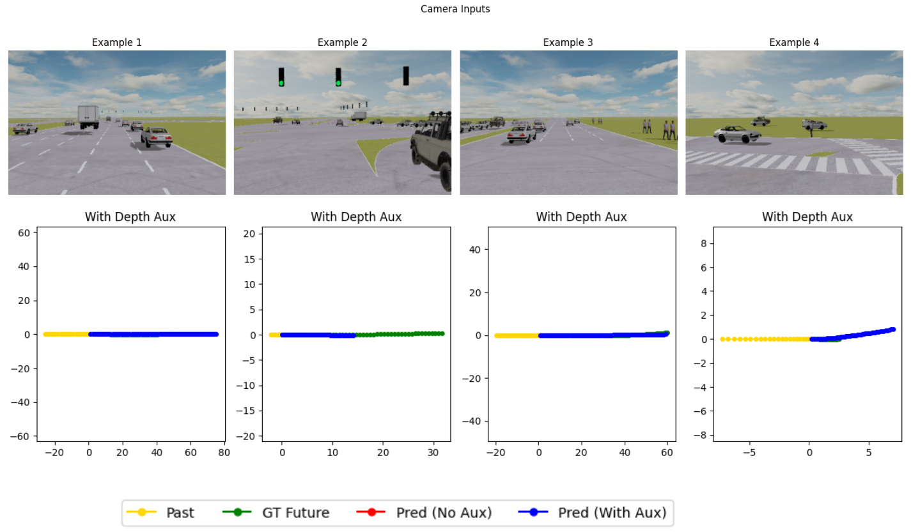

# End-to-End Planning for Autonomous Driving · Phase 2

> EPFL — CIVIL-459 “Deep Learning for Autonomous Vehicles”  
> Milestone 2 — **deadline 16 May 2025**

> **Team**: Rim El Qabli *(Sciper 340997)*, Mathéo Taillandier *(Sciper 339442)*

---

## 1. Repository structure

| Path                             | Description                                                                                                 |
| -------------------------------- | ----------------------------------------------------------------------------------------------------------- |
| `DLAV_Phase2_Final.ipynb`        | Notebook containing end-to-end training, evaluation, visualization, and export of the Phase 2 planner.      |
| `README.md`                      | This document, outlining design decisions and layout for Phase 2.                                           |
| `submission_phase2.csv`          | CSV formatted for submission to the [Kaggle DLAV_phase_2 competition](https://www.kaggle.com/t/a7295af1cfa349eeb57d08538d44cf58). |
| `images_phase2/loss_vs_epoch_phase2.png`| Plot of training and validation loss curves across epochs in Phase 2.                                        |
| `images_phase2/sample_aux_outputs.png`  | Examples of predicted trajectories VS ground truth. |
| `images_phase2/sample_depth.png`  | Examples of corresponding depth outputs. |
| `images_phase2/sample_semantic.png`  | Examples of corresponding semantic outputs. |

All code dependencies and datasets are encapsulated in the notebook above.

---

## 2. Problem statement

**Inputs**:

- An RGB dash-cam image at time **t**  
- Past **21** ego-centric poses *(x, y, heading)*  
- Auxiliary sensor data: **depth** and **semantic** maps  

**Outputs**:

- Future **60** poses  
- **Depth** map prediction (L1 regression)  
- **Semantic** segmentation (14-class cross-entropy)

**Allowed modalities**: camera · driving command · trajectory history · depth · semantic  
**Evaluation metric**: **Average Displacement Error (ADE)**. Target: **ADE < 1.60 m** by submitting `submission_phase2.csv` on Kaggle.

---

## 3. Execution environment

Tested on:

| Platform | GPU               | Training duration |
| -------- | ----------------- | ----------------- |
| Colab    | NVIDIA T4/A100    | ~60 minutes       |

---

## 4. Perception-guided enhancements

To better regularize the model, these 2 auxiliary perception tasks are used:

1. **Depth estimation**  
   - Five upsampling blocks + final convolution → coarse 1×224×320 depth map.  
   - Provides geometric cues without overfitting to pixel-perfect depth.

2. **Semantic segmentation**  
   - Five upsampling blocks + final convolution → coarse 14×224×320 class logits.  
   - Encourages scene understanding (road, vehicles, pedestrians, etc.) without optimizing for exact IOU.

By sharing the encoder, these tasks help regularize the main planner.

---

## 5. Model architecture

Building on Phase 1, our multi-task planner consists of:

1. **SlimConvNet image encoder**  
   - 3×(Conv+Pool) + AdaptiveAvgPool → 512-d visual embedding + 128×4×4 spatial feature map.

2. **GRU trajectory encoder**  
   - Single-layer GRU (hidden=128) over the 21 past poses → 128-d vector.

3. **Fusion & residual planner head**  
   - Concatenate visual (512-d) + history (128-d) → MLP → residual prediction of 60×3 trajectory.

4. **Auxiliary decoders**  
   - **DepthDecoder**: series of upsampling → depth map.  
   - **SemanticDecoder**: series of upsampling → segmentation logits.

---

## 6. Training details

| Hyperparameter         | Configuration                                              |
| ---------------------- | ---------------------------------------------------------- |
| Batch size             | 16                                                         |
| Optimizer              | AdamW                                                      |
| Learning rate          | 1×10⁻³                                                     |
| Weight decay           | 1×10⁻³                                                     |
| LR scheduler           | ReduceLROnPlateau (patience=5, factor=0.5)                |
| Max epochs             | 200 (early stopping on ADE with patience=10)               |
| Auxiliary weights      | λ_depth=0.001, λ_semantic=0.4                              |

---

## 7. Experimental results

| Dataset split         | ADE ↓        | Remarks                                       |
| --------------------- | ------------ | --------------------------------------------- |
| Kaggle public test    | **1.58539 m** | Surpasses the 1.60 m ADE target   |

### Loss curve analysis

- **Sharp initial drop**:  
  - **Epoch 1** starts with a high train loss of ~2.41 and val loss ~1.60 (ADE ≈ 3.47).  
  - By **epoch 5**, train loss falls to ~1.16, val to ~1.09 (ADE ≈ 2.39).

- **Validation spike around epoch 10**:  
  - A brief jump in val loss to ~2.21 (train ≈ 0.91) and ADE spikes to 3.33 at epoch 10, likely due to a transient learning instability or scheduler adjustment.

- **Steady decline and convergence**:  
  - After the spike, both curves resume their downward trend.  
  - By **epoch 20**, train ≈ 0.64, val ≈ 0.76 (ADE ≈ 2.08).  
  - From **epoch 30 onward**, the train loss plateaus around 0.45–0.50, val around 0.55–0.60.

- **Late-stage stability & best performance**:  
  - ADE continues to improve, reaching its minimum (~1.584) around epoch 82.  
  - The modest train–val gap throughout later epochs indicates that the depth and semantic auxiliary heads effectively regularize the planner, preventing overfitting and yielding consistent generalization on the validation set.

### Example outputs

- Predicted trajectories (blue) align closely with ground-truth future paths (green).  
- We can notice that the depth and semantic predictions reflect scene layout very roughly (roads, obstacles, traffic elements). This shows how the auxiliary tasks are not overfitted and therefore only helped regularize the main task. 

---
