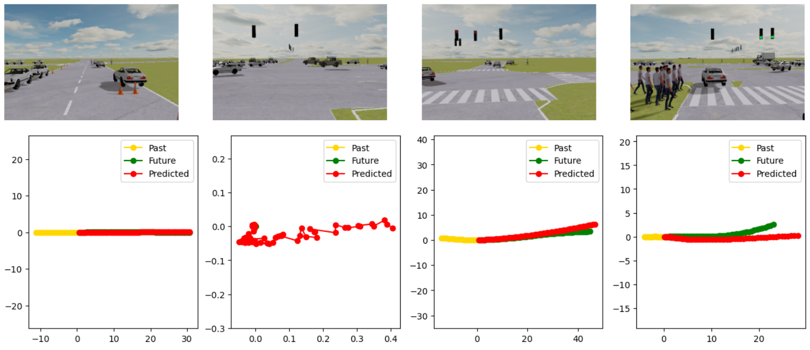
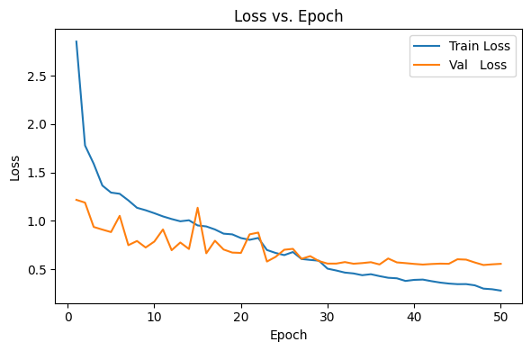
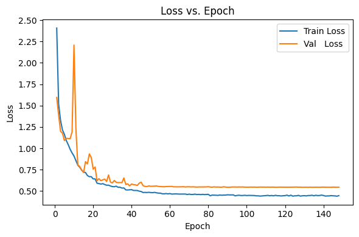
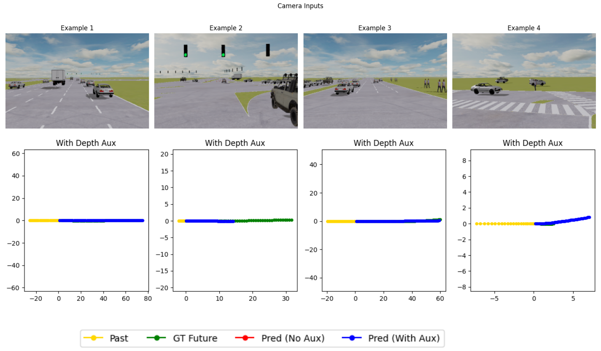
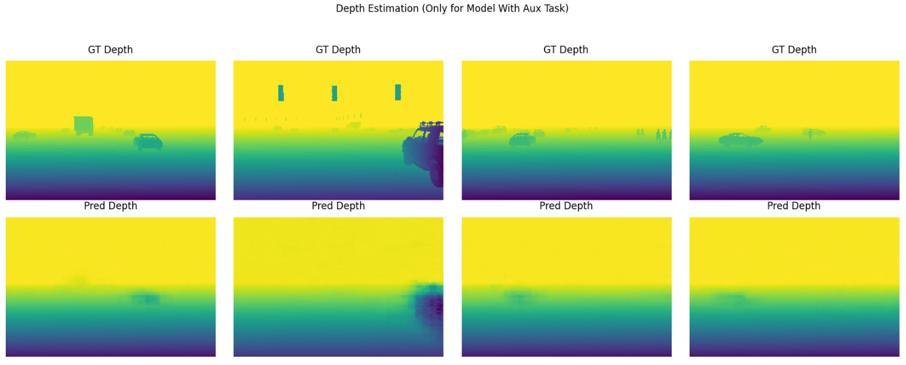
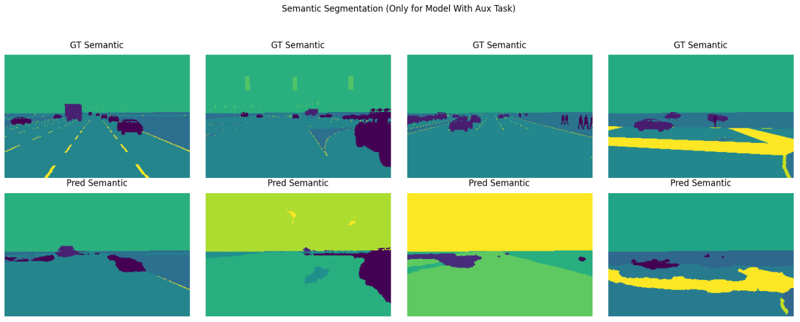
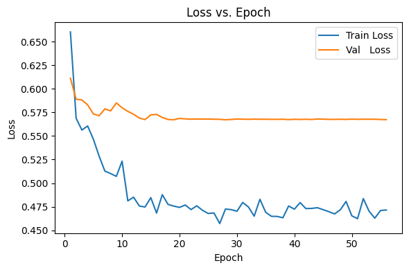
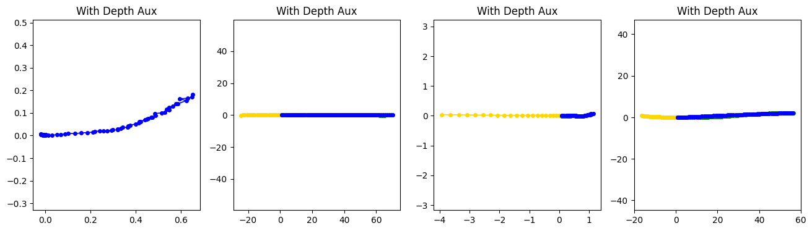

# End-to-End Planning for Autonomous Driving · Deep Learning for Autonomous Vehicles Project

# Phase 1

> EPFL — CIVIL-459 “Deep Learning for Autonomous Vehicles”  
> Milestone 1 — **deadline 2 May 2025**

> **Team** : Rim El Qabli *(Sciper 340997)*, Mathéo Taillandier *(Sciper 339442)*

---

## 1. Repository layout

| Path                      | Purpose                                                                                   |
| ------------------------- | ----------------------------------------------------------------------------------------- |
| DLAV_Phase1_Final.ipynb   | A self-contained notebook that trains, validates, visualizes, and exports the Phase 1 planner. |
| README.md                 | You are reading it. Describes structure and design choices.                                   |
| submission_phase1.csv     | Output CSV file formatted for submission used on the [Kaggle DLAV_phase_1 competition](https://www.kaggle.com/t/338eec1b2cd346eaa3b569340ab2de19).                                                    |
| images/loss_vs_epoch.png  | Visualization of training and validation losses over epochs.                                                  |
| images/sample_predictions.png | Example predictions visualized from the model output. 

Everything needed to run our code is inside the notebook.

---

## 2. Task recap

Given the inputs:

- An RGB dash-cam frame at time step **t**  
- The vehicle’s past **21** ego-centric poses *(x, y, heading)*  

Predict the next **60** poses.

**Allowed inputs:** camera image · driving command *(left / right / forward)* · past trajectory  
**Metric:** **Average Displacement Error (ADE)** — lower is better. The goal in this milestone is to obtain an **ADE score less than 2** by uploading the generated `submission_phase1.csv` to the [Kaggle DLAV_phase_1 competition](https://www.kaggle.com/t/338eec1b2cd346eaa3b569340ab2de19).

---

## 3. Environment

We tested on:

| Setup | GPU               | Approx. Training Time |
| ----- | ----------------- | --------------------- |
| Colab | NVIDIA T4 or A100 | ~45 min               |

---

## 4. Starter code base architecture Analysis

=> "*By running the code above, you have trained your first model! What do you observe in terms of train and val losses? What is this phenomenon called?* "

The training loss shows a consistent decline, dropping from very high initial values to much lower ones by the end of training. In contrast, the validation loss decreases initially but then begins to plateau and fluctuate, remaining noticeably higher than the training loss. This pattern indicates that the model is fitting the training data too closely, capturing specific details and noise rather than learning generalizable features. As a result, its performance on new, unseen data is worse. This behavior is known as overfitting, where a model becomes too specialized to the training set and fails to generalize effectively to other data.

---

## 5. Our architecture implementation

We designed a lightweight but effective planner with four key components:

1. **Image encoder (CNN vs. ViT)**  
   - A five-stage convolutional network processes 200×300 RGB frames.  
   - Chosen over ViTs because our ~5000-image dataset leads transformers to overfit without extensive data augmentation or pretraining.

2. **Trajectory encoder (LSTM)**  
   - A single-layer LSTM (hidden = 256) ingests the past 21 poses, capturing temporal dependencies in position and heading.  
   - Outperformed GRUs and temporal convolutional layers, particularly in maintaining consistent heading predictions.

3. **Late fusion**  
   - We concatenate the 512-dim CNN embedding with the 256-dim LSTM hidden state immediately before the prediction head.  
   - Early- or mid-level fusion increased compute by >2× for negligible accuracy gains, so we kept it simple and efficient.

4. **Residual prediction head**  
   - A 4-layer MLP with a linear shortcut: the network predicts a coarse offset which is added to a direct linear projection of the fused embedding.  
   - This residual connection stabilizes gradients in early epochs and reduced ADE.

---

## 6. Training hyperparameters

| Hyperparameter       | Value                                                         |
| -------------------- | ------------------------------------------------------------- |
| Batch size           | 32                                                            |
| Optimizer            | AdamW                                                         |
| Initial LR           | 3 × 10⁻⁴                                                     |
| Weight decay         | 1 × 10⁻³                                                     |
| Scheduler            | ReduceLROnPlateau (patience 5, factor 0.5)                    |
| Epochs               | 50                                                           |
| Data augmentation    | 50 % horizontal flip (image and sign flip of x-coordinates)   |

---

## 7. Results

| Split               | ADE ↓      | Notes                                         |
| ------------------- | ---------- | --------------------------------------------- |
| Kaggle public test  | **1.66331 m**  | Team on the Kaggle leaderboard : ***Mathéo & Rim*** |

We obtained the following output visualizations from our model:

The training and validation loss curves (see graph above) show:

- **Rapid initial convergence**: Both train and val losses drop sharply in the first 5–10 epochs, meaning the model quickly learns the core scene-to-trajectory mapping.  
- **Slower later improvement**: After epoch 10, train loss continues its downward trend while validation loss flattens around 0.55–0.60, suggesting that additional epochs yield only marginal gains on unseen data.
From ~epoch 35 onward, the gap widens (train < 0.40 vs. val ≈ 0.55), showing the model fits the training set a bit more tightly but still maintains very reasonable generalization.  
- **Consistent final performance**: Despite minor val-loss fluctuations, the public-test ADE of 1.66 m confirms we meet the sub-2 m milestone with room to spare.

---

# Phase 2

> EPFL — CIVIL-459 “Deep Learning for Autonomous Vehicles”  
> Milestone 2 — **deadline 16 May 2025**

> **Team**: Rim El Qabli *(Sciper 340997)*, Mathéo Taillandier *(Sciper 339442)*

---

## 1. Repository structure

| Path                             | Description                                                                                                 |
| -------------------------------- | ----------------------------------------------------------------------------------------------------------- |
| `DLAV_Phase2_Final.ipynb`        | Notebook containing end-to-end training, evaluation, visualization, and export of the Phase 2 planner.      |
| `README.md`                      | This document, outlining design decisions and layout for Phase 2.                                           |
| `submission_phase2.csv`          | CSV formatted for submission to the [Kaggle DLAV_phase_2 competition](https://www.kaggle.com/t/a7295af1cfa349eeb57d08538d44cf58). |
| `images/loss_vs_epoch_phase2.png`| Plot of training and validation loss curves across epochs in Phase 2.                                        |
| `images/sample_aux_outputs.png`  | Examples of predicted trajectories VS ground truth. |
| `images/sample_depth.png`  | Examples of corresponding depth outputs. |
| `images/sample_semantic.png`  | Examples of corresponding semantic outputs. |

All code dependencies and datasets are encapsulated in the notebook above.

---

## 2. Problem statement

**Inputs**:

- An RGB dash-cam image at time **t**  
- Past **21** ego-centric poses *(x, y, heading)*  
- Auxiliary sensor data: **depth** and **semantic** maps  

**Outputs**:

- Future **60** poses  
- **Depth** map prediction (L1 regression)  
- **Semantic** segmentation (14-class cross-entropy)

**Allowed modalities**: camera · driving command · trajectory history · depth · semantic  
**Evaluation metric**: **Average Displacement Error (ADE)**. Target: **ADE < 1.60 m** by submitting `submission_phase2.csv` on Kaggle.

---

## 3. Execution environment

Tested on:

| Platform | GPU               | Training duration |
| -------- | ----------------- | ----------------- |
| Colab    | NVIDIA T4/A100    | ~60 minutes       |

---

## 4. Perception-guided enhancements

To better regularize the model, these 2 auxiliary perception tasks are used:

1. **Depth estimation**  
   - Five upsampling blocks + final convolution → coarse 1×224×320 depth map.  
   - Provides geometric cues without overfitting to pixel-perfect depth.

2. **Semantic segmentation**  
   - Five upsampling blocks + final convolution → coarse 14×224×320 class logits.  
   - Encourages scene understanding (road, vehicles, pedestrians, etc.) without optimizing for exact IOU.

By sharing the encoder, these tasks help regularize the main planner.

---

## 5. Model architecture

Building on Phase 1, our multi-task planner consists of:

1. **SlimConvNet image encoder**  
   - 3×(Conv+Pool) + AdaptiveAvgPool → 512-d visual embedding + 128×4×4 spatial feature map.

2. **GRU trajectory encoder**  
   - Single-layer GRU (hidden=128) over the 21 past poses → 128-d vector.

3. **Fusion & residual planner head**  
   - Concatenate visual (512-d) + history (128-d) → MLP → residual prediction of 60×3 trajectory.

4. **Auxiliary decoders**  
   - **DepthDecoder**: series of upsampling → depth map.  
   - **SemanticDecoder**: series of upsampling → segmentation logits.

---

## 6. Training details

| Hyperparameter         | Configuration                                              |
| ---------------------- | ---------------------------------------------------------- |
| Batch size             | 16                                                         |
| Optimizer              | AdamW                                                      |
| Learning rate          | 1×10⁻³                                                     |
| Weight decay           | 1×10⁻³                                                     |
| LR scheduler           | ReduceLROnPlateau (patience=5, factor=0.5)                |
| Max epochs             | 200 (early stopping on ADE with patience=10)               |
| Auxiliary weights      | λ_depth=0.001, λ_semantic=0.4                              |

---

## 7. Experimental results

| Dataset split         | ADE ↓        | Remarks                                       |
| --------------------- | ------------ | --------------------------------------------- |
| Kaggle public test    | **1.58539 m** | Surpasses the 1.60 m ADE target   |

### Loss curve analysis

- **Sharp initial drop**:  
  - **Epoch 1** starts with a high train loss of ~2.41 and val loss ~1.60 (ADE ≈ 3.47).  
  - By **epoch 5**, train loss falls to ~1.16, val to ~1.09 (ADE ≈ 2.39).

- **Validation spike around epoch 10**:  
  - A brief jump in val loss to ~2.21 (train ≈ 0.91) and ADE spikes to 3.33 at epoch 10, likely due to a transient learning instability or scheduler adjustment.

- **Steady decline and convergence**:  
  - After the spike, both curves resume their downward trend.  
  - By **epoch 20**, train ≈ 0.64, val ≈ 0.76 (ADE ≈ 2.08).  
  - From **epoch 30 onward**, the train loss plateaus around 0.45–0.50, val around 0.55–0.60.

- **Late-stage stability & best performance**:  
  - ADE continues to improve, reaching its minimum (~1.584) around epoch 82.  
  - The modest train–val gap throughout later epochs indicates that the depth and semantic auxiliary heads effectively regularize the planner, preventing overfitting and yielding consistent generalization on the validation set.

### Example outputs

- Predicted trajectories (blue) align closely with ground-truth future paths (green).  
- We can notice that the depth and semantic predictions reflect scene layout very roughly (roads, obstacles, traffic elements). This shows how the auxiliary tasks are not overfitted and therefore only helped regularize the main task. 

---

# Phase 3

> EPFL — CIVIL-459 “Deep Learning for Autonomous Vehicles”  
> Milestone 2 — **deadline 23 May 2025**

> **Team**: Rim El Qabli *(Sciper 340997)*, Mathéo Taillandier *(Sciper 339442)*

---

## 1. Repository structure

| Path                             | Description                                                                                                 |
| -------------------------------- | ----------------------------------------------------------------------------------------------------------- |
| `DLAV_Phase3_Final.ipynb`        | Notebook containing end-to-end training, evaluation, visualization, and export of the Phase 3 planner.      |
| `README.md`                      | This document, outlining design decisions and layout for Phase 3.                                           |
| `submission_phase3.csv`          | CSV formatted for submission to the [Kaggle DLAV_phase_3 competition](https://www.kaggle.com/competitions/dlav-phase-3). |
| `images/loss_vs_epoch_phase3.png`| Plot of training and validation loss curves across epochs in Phase 3.                                        |
| `images/sample_outputs.png`  | Examples of predicted trajectories VS ground truth. |

All code dependencies and datasets are encapsulated in the notebook above.

---

## 2. Problem statement

**Inputs**:

- An RGB dash-cam image at time **t**  
- Past **21** ego-centric poses *(x, y, heading)*  

**Outputs**:

- Future **60** poses  
- **Depth** map prediction (L1 regression)  
- **Semantic** segmentation (14-class cross-entropy)

**Allowed modalities**: camera · driving command · trajectory history · depth · semantic  
**Evaluation metric**: **Average Displacement Error (ADE)**. Target: **ADE < 1.80 m** by submitting `submission_phase3.csv` on Kaggle.

---

## 3. Execution environment

Tested on:

| Platform | GPU               | Training duration |
| -------- | ----------------- | ----------------- |
| Colab    | NVIDIA T4/A100    | ~10 minutes       |

---
## 4. Model architecture

Building on Phase 1, our multi-task planner consists of:

1. **SlimConvNet image encoder**  
   - 3×(Conv+Pool) + AdaptiveAvgPool → 512-d visual embedding + 128×4×4 spatial feature map.

2. **GRU trajectory encoder**  
   - Single-layer GRU (hidden=128) over the 21 past poses → 128-d vector.

3. **Fusion & residual planner head**  
   - Concatenate visual (512-d) + history (128-d) → MLP → residual prediction of 60×3 trajectory.

4. **Auxiliary decoders**  
   - **DepthDecoder**: series of upsampling → depth map.  
   - **SemanticDecoder**: series of upsampling → segmentation logits.

---

## 5. Training details

| Hyperparameter         | Configuration                                              |
| ---------------------- | ---------------------------------------------------------- |
| Batch size             | 32                                                         |
| Optimizer              | AdamW                                                      |
| Learning rate          | 3×10⁻⁴                                                     |
| Weight decay           | 1×10⁻³                                                     |
| LR scheduler           | ReduceLROnPlateau (patience=3, factor=0.1)                |
| Max epochs             | 10 (early stopping on ADE with patience=20)               |
| Auxiliary weights      | λ_depth=0.001, λ_semantic=0.4                              |

---

## 6. Experimental results

| Dataset split         | ADE ↓        | Remarks                                       |
| --------------------- | ------------ | --------------------------------------------- |
| Kaggle public test    | **1.64401 m** | Surpasses the 1.80 m ADE target   |

### Loss curve analysis

- **Fine tuning**:  
  - As can be seen in the loss curves, the training loss and the validation loss decrease heavily in the first few epochs, and then find a plateau quite fast. This is due to the fact that the model is already trained and is only being fine tuned for the real images. 
  - There are some spikes in the loss in both training and validation loss around epoch 10, but the thus reduced learning rate allows for a stabilization then on.

- **Convergence**:
  - Convergence is reached around epoch 20

### Example outputs

- Predicted trajectories (blue) align closely with ground-truth future paths (green).  

---
